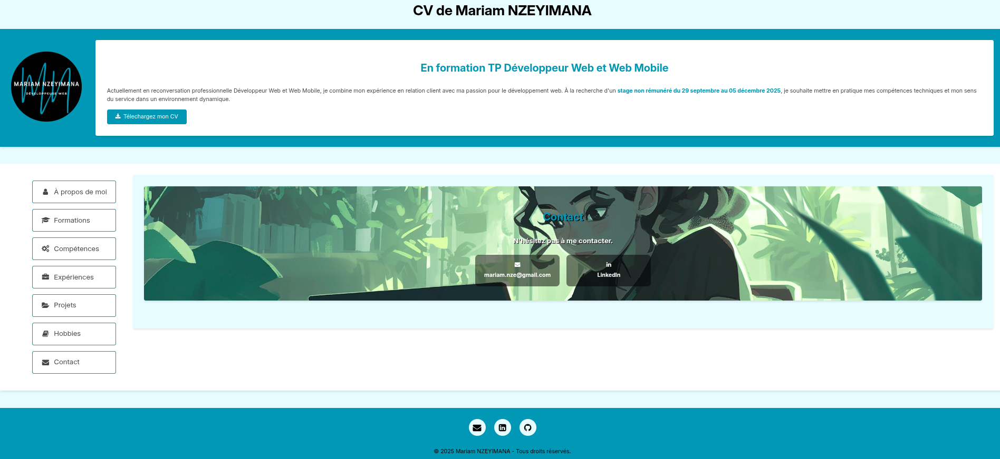

# Digital Resume 💻📄

Projet completed during my training course [DWWM](https://gretaformation.ac-orleans-tours.fr/formation/titre-professionnel-developpeur-web-et-web-mobile) at [MAME](https://mame-tours.com/).

**Objective** : Create a simple web page using the basic elements of HTML and CSS.

**Description** : Create a digital resume to present to companies.

A live version of this project can be found at https://mariamnze.github.io/cv.

